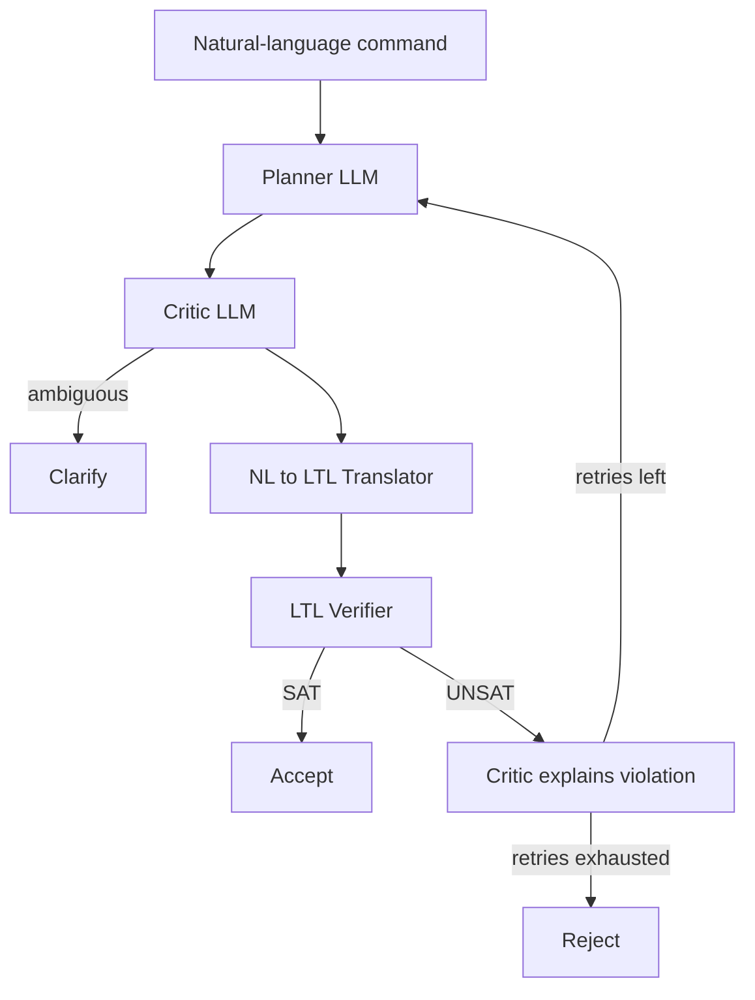

# LTL-Augmented Multi-Agent Intent Filtering for LLM-Enabled Robots

Research artifact for the Wits University Honours research proposal
**"Evaluating the Impact of Linear Temporal Logic Verification on
Recall-Safety Tradeoffs in Multi-Agent Intent Filtering for LLM-Enabled
Robots"** (George Ayensu, student no. 2722188). Supervisors: Steven James and
Benjamin Rosman.

This repository implements and compares four intent-filtering architectures
for LLM-guided household robots - a single-LLM baseline, a multi-agent
Planner-Critic baseline, and both augmented with a deterministic Linear
Temporal Logic (LTL) verifier - to evaluate whether formal verification
improves rejection of unsafe or misdirected commands while preserving recall
on legitimate ones, relative to prompting-only architectures.

## Motivation

LLMs interpreting natural-language commands for physical robots can
hallucinate plausible-sounding but unsafe action sequences, and are
susceptible to adversarial or ambiguous phrasing that prompting-only safety
checks may not reliably catch. Because an LLM's safety judgement is itself
probabilistic, it cannot *guarantee* that a rule (e.g. "never carry the knife
into the child's room") holds - a deterministic formal verifier checked
against an explicit, auditable rule base can. This project measures the
actual recall/safety tradeoff of adding that verifier, rather than assuming
it's a free win.

## Architecture overview

Four systems, sharing the same environment, dataset, and evaluation harness:

1. **Single-LLM Intent Filter (Baseline A)** - one LLM call plans and
   adjudicates (Accept/Reject/Clarify) via prompting alone.
2. **Multi-Agent Planner-Critic (Baseline B)** - a Planner LLM proposes a
   candidate plan; a Critic LLM reviews it. Still fully probabilistic.
3. **Single-LLM + LTL** - Baseline A plus a deterministic LTL verifier
   checking a translated formula against the safety rule base.
4. **Multi-Agent + LTL (proposed)** - Planner + Critic + NL->LTL Translator +
   LTL Verifier + a decision layer with a bounded reprompting loop on
   verifier UNSAT.



Full per-system diagrams: [docs/architecture.md](docs/architecture.md).
Evaluation design and formalism choices: [docs/methodology.md](docs/methodology.md).

## Repository structure

```
config/                  Ontology, safety rule base, and experiment config (YAML)
intent_filter/            Python package
  environment/             Ontology, symbolic state machine, safety rules, SimulatorBackend
  agents/                   Planner / Critic / NL->LTL Translator LLM wrappers (Phase 4)
  verifier/                 Deterministic LTLf verification backend (flloat)
  systems/                  The four pipeline configurations (Phase 5)
  decision.py               Decision layer + reprompting loop (Phase 5)
data/                     Dataset schema, labeled instructions, generation scripts
scripts/                  Evaluation harness + manual debug CLI
tests/                    pytest unit + smoke tests (mocked LLMs, no network calls)
results/                  Gitignored evaluation run outputs (timestamped per run)
docs/                     Architecture and methodology docs
```

## Setup

Requires Python 3.11+ (developed against 3.12).

```bash
python -m venv .venv
.venv\Scripts\activate        # Windows
pip install -e ".[dev]"
copy config\config.example.yaml config\config.yaml
copy .env.example .env        # then fill in ANTHROPIC_API_KEY (needed from Phase 4 onward)
```

`config/config.yaml` and `.env` are gitignored - never commit API keys.
`config/config.yaml` controls per-role model choice, dataset path, evaluation
repeat count, and ablation flags; if absent, the loader falls back to
`config/config.example.yaml`.

No system-level dependencies are required. The LTL verifier uses `flloat`
(pure-Python LTLf), installed automatically via `pip install -e ".[dev]"` -
see [docs/methodology.md](docs/methodology.md#ltl-vs-ltlf-formalism-choice)
for why `flloat` was chosen over `spot` (no PyPI distribution, weak native
Windows support) and `ltlf2dfa` (depends on the external MONA binary).

## Usage

Run a single instruction through any of the four systems (manual/debug CLI,
implemented in Phase 5):

```bash
python scripts/run_single_instruction.py --system multi_agent_ltl --text "Bring the knife to the child's room"
```

Run the full evaluation across all systems and the dataset (Phase 6):

```bash
python scripts/run_evaluation.py --config config/config.yaml
```

Run tests (no live LLM calls; agents are mocked):

```bash
pytest
```

## Dataset

`data/instructions.jsonl` (JSON Lines), one instruction per line, across four
categories with gold Accept/Reject/Clarify labels:

- **Legitimate** - safe, unambiguous -> `Accept`.
- **Unsafe** - violates a safety rule -> `Reject`.
- **Ambiguous** - underspecified reference -> `Clarify`.
- **Misdirected** - semantically valid but violates a mission-level
  constraint -> `Reject`.

Schema and regeneration instructions: `data/dataset_schema.md` (Phase 3).
Target size is 300-500 labeled examples, seeded with 60-80 hand-authored
examples covering every safety rule (both a violating and a non-violating
example each) before scaling up via reviewed LLM-assisted generation
(`data/scripts/generate_dataset.py`). Dataset design is inspired by, not
sourced from, SafeAgentBench / 3DOC / Ambi3D-style benchmarks referenced in
the proposal; those external datasets are not bundled.

## Evaluation metrics

Recall, Precision, Specificity, F1, False Rejection Rate (FRR), and latency
(mean/p50/p95, broken down by LLM inference / NL->LTL translation /
verification stage). Full definitions: [docs/methodology.md](docs/methodology.md#metrics).
Each configuration is run multiple times (default 3-5) to account for LLM
stochasticity; results report mean ± confidence interval, with McNemar's
test for paired classification comparisons and ANOVA/Kruskal-Wallis for
latency comparisons across systems.

## Current status / roadmap

- [x] **Phase 1** - Repo scaffolding, config system, environment ontology +
      state machine + transition function, safety rule base, unit tests.
- [x] **Phase 2** - LTLf verifier integration (`flloat`); see
      [docs/methodology.md](docs/methodology.md#ltl-vs-ltlf-formalism-choice)
      for the formalism choice and atom-sanitization design note.
- [ ] **Phase 3** - Dataset schema + seed dataset (60-80 examples).
- [ ] **Phase 4** - Planner / Critic / Translator LLM-backed agents.
- [ ] **Phase 5** - Four pipeline systems + decision layer + reprompting loop.
- [ ] **Phase 6** - Evaluation harness: metrics, repeats, statistical tests, ablations, plots.
- [ ] **Phase 7** - Scale dataset to 300-500 reviewed examples.
- [ ] **Phase 8** - Full evaluation run + methodology write-up sync.

## Citation / academic context

This repository is the implementation accompanying a Wits University
Honours research proposal by George Ayensu (2722188), supervised by
Steven James and Benjamin Rosman.

### AI Assistance Disclosure

Substantial portions of this codebase (scaffolding, boilerplate, and in
places full module implementations) were generated with **Claude Code**
(Anthropic), under the author's direction and review. Per Wits University
policy, use of AI tools in producing this work must be formally declared.

> **TODO (author action required):** complete the official Wits AI
> declaration form with the specifics of how Claude Code was used in this
> repository, and reference it here / in the accompanying report. This README
> note is a flag, not a substitute for that declaration.

## License

MIT - see [LICENSE](LICENSE).
