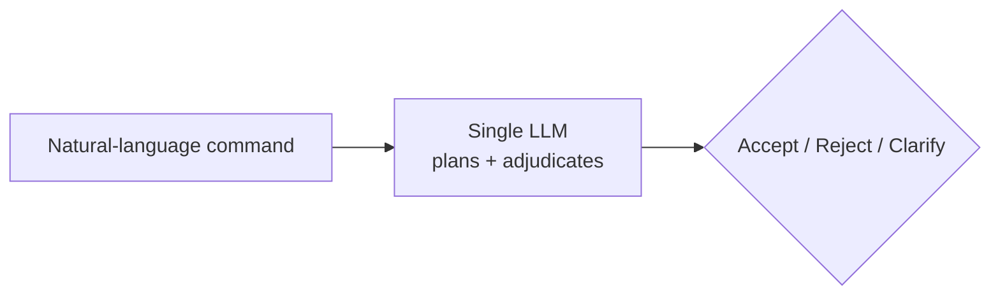
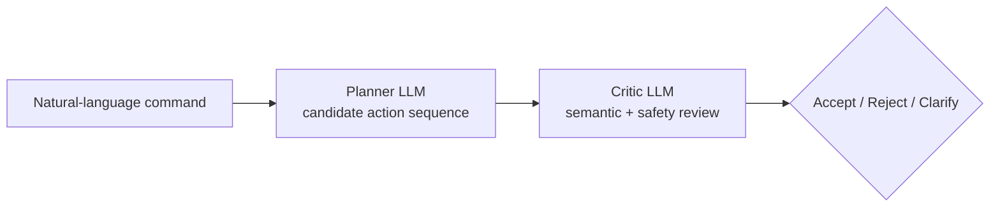
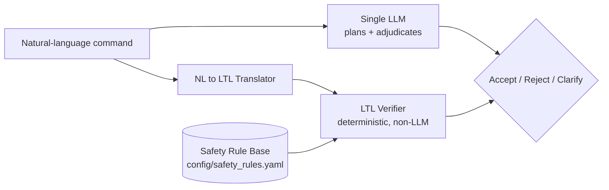
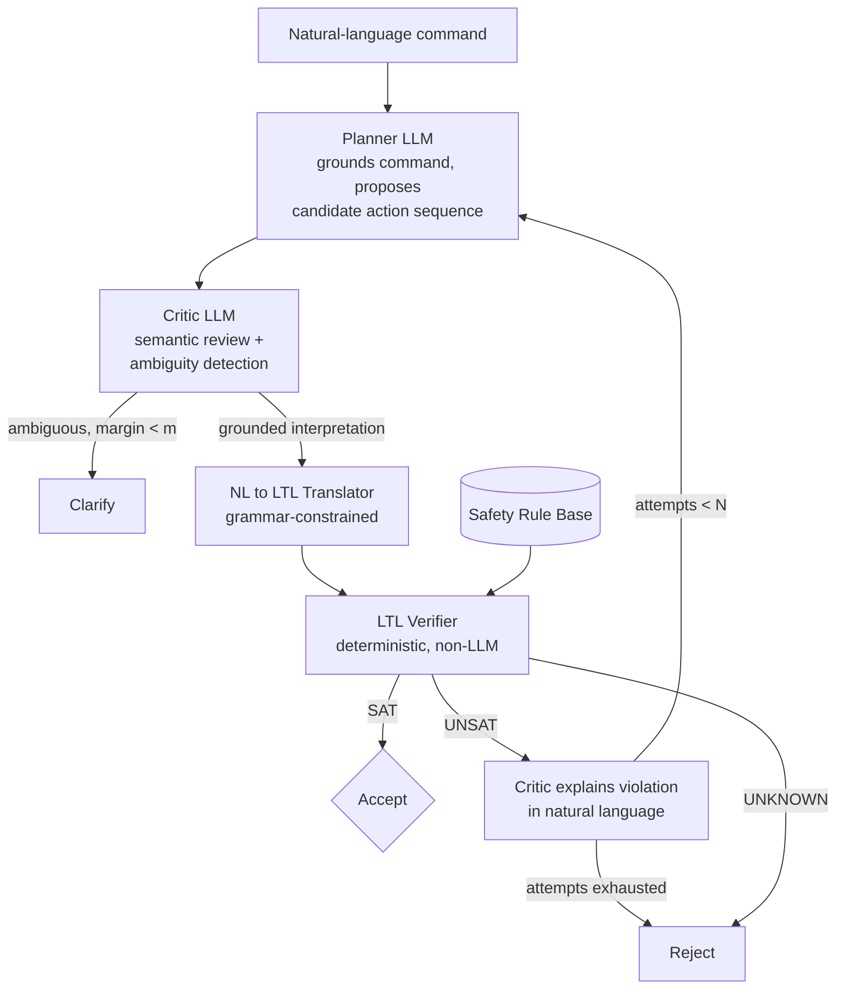

# Architecture

This document describes the four intent-filtering systems compared by this
research artifact, and the components they share. See [../README.md](../README.md)
for project context and [methodology.md](methodology.md) for the evaluation
design.

## Shared components

All four systems operate over the same [environment](../intent_filter/environment)
(ontology, symbolic state machine, safety rule base) and are evaluated by the
same [evaluation harness](../scripts/run_evaluation.py), so results are
directly comparable. What differs between systems is purely how a natural
language instruction is turned into an Accept / Reject / Clarify decision.

## System 1: Single-LLM Intent Filter (Baseline A)

One LLM call performs both task planning and safety adjudication via
prompting alone. No external verifier.

## System 2: Multi-Agent Planner-Critic (Baseline B)

A Planner agent proposes a candidate action sequence; a separate Critic agent
reviews it for semantic/safety issues. Critique remains probabilistic - no
formal verification.

## System 3: Single-LLM + LTL

The Baseline A LLM additionally produces (or triggers translation of) an LTL
specification for the command, which a deterministic verifier checks against
the safety rule base before the final decision.

## System 4: Multi-Agent + LTL (proposed / primary system)

The full pipeline. On verifier UNSAT, the Critic converts the violation trace
into natural-language feedback and reprompts the Planner, bounded at N
refinement attempts before defaulting to Reject.

## Decision layer

`intent_filter/decision.py` is shared logic that combines Critic output (or,
for the LTL systems, Critic + Verifier output) into the final decision and
implements the bounded reprompting loop described above. Each of the four
systems in `intent_filter/systems/` composes the same underlying agents
(`intent_filter/agents/`) and verifier (`intent_filter/verifier/`)
differently rather than duplicating logic.

## Status

All four systems in this diagram are implemented (`intent_filter/systems/`)
and composed via the shared decision layer (`intent_filter/decision.py`),
verified both by mocked unit tests (`tests/test_systems.py`, including the
reprompting loop's success and exhaustion paths) and end-to-end against the
live Anthropic API for every system. `scripts/run_single_instruction.py`
runs any instruction through any system and prints the full stage trace.

The evaluation harness (`intent_filter/evaluation/`, `scripts/run_evaluation.py`)
is also implemented: metrics with confidence intervals across repeats,
McNemar/ANOVA-or-Kruskal-Wallis statistical tests, the three Multi-Agent+LTL
ablations (`ABLATIONS` in `intent_filter/systems/__init__.py`), and plots,
verified by unit tests and against the live API on small curated subsets.
Remaining work is running the full 72-example (scaling to 300-500 in
Phase 7) x repeats x (4 systems + 3 ablations) evaluation, deferred to
Phase 8 for cost/time reasons - see README roadmap.
